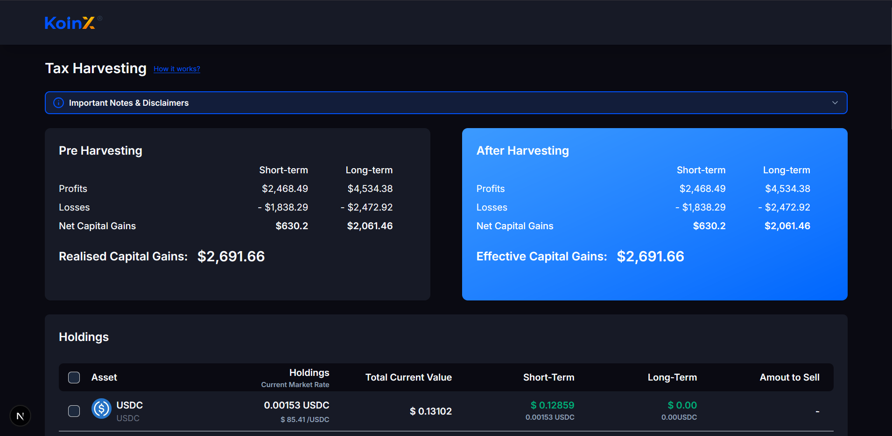
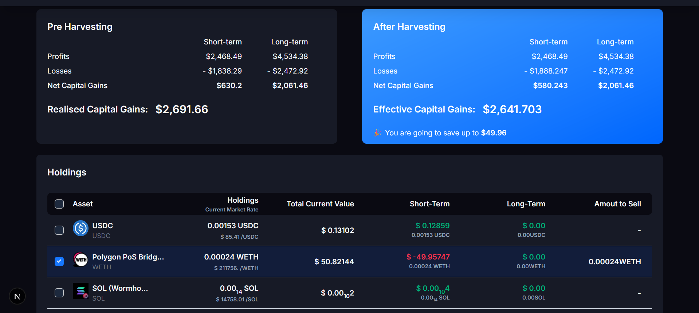
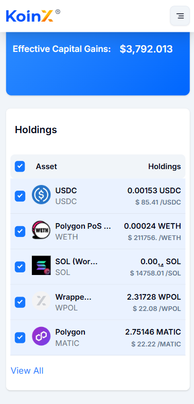
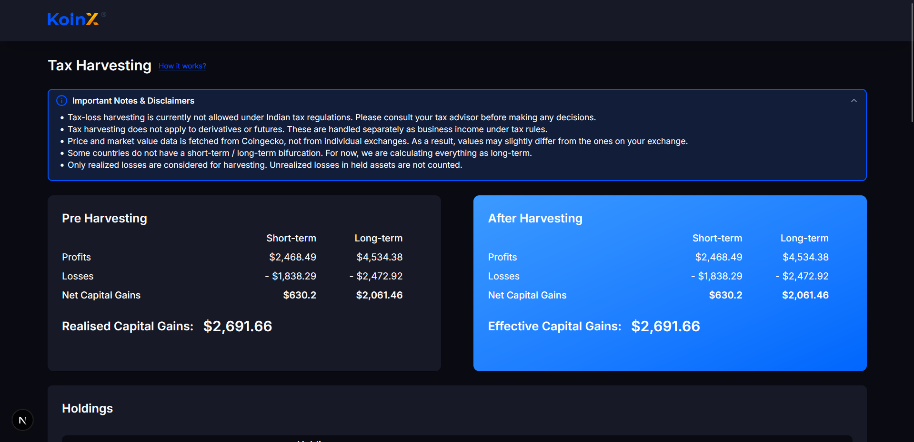

# KoinX-assignment

This is a responsive frontend application built using **Next.js** and **Context API** to manage global state. It showcases a list of crypto holdings with sorting, selection toggling, and capital gains calculations.


## 🔧 Setup Instructions

1. **Clone the repository**
   ```bash
   git clone https://github.com/your-username/koinx-assignment.git
   cd koinx-assignment
2. **Install dependencies**

    ```bash
    Copy
    Edit
    npm install
3. **Run the development server**

    ```bash
    Copy
    Edit
    npm run dev
Open http://localhost:3000 in your browser to view the app.

## Screenshots







## 📌 Assumptions
The data persists over time once fetched.

Since this is a frontend-only implementation using a mock backend, there is no real-time re-listening to data updates from the server.

## 🛠️ Tech Stack
Framework: Next.js

State Management: React Context API

Styling: Tailwind CSS

Icons/Assets: Lucide, static assets